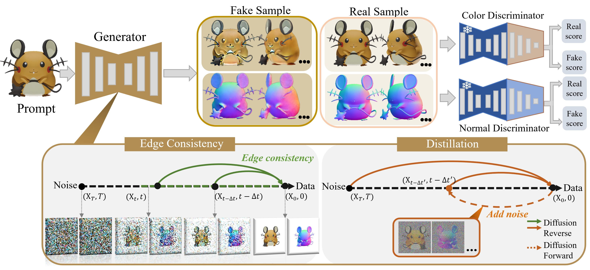

 

    <h1 align="center">
        <a href="#">Acc3D</a>: Accelerating Single Image to 3D Diffusion Models via Edge Consistency Guided Score Distillation
    </h1>

  

  CVPR 2025
     
    <strong>Kendong Liu</strong>
    ·
    <a href="https://scholar.google.com/citations?user=d1L0KkoAAAAJ&hl=en"><strong>Zhiyu Zhu*</strong></a>
    ·
    <strong>Hui Liu</strong>
    ·
    <a href="https://sites.google.com/site/junhuihoushomepage/"><strong>Junhui Hou</strong></a>
    ·
  

  

    
  

 

This repository contains the pytorch implementation for the paper [Acc3D: Accelerating Single Image to 3D Diffusion Models via Edge Consistency Guided Score Distillation](https://acc3d-object.github.io/), CVPR 2025. 

## News
- [2025-02-27] Our paper has been accpetd by CVPR 2024!

## Code
Coming soon!