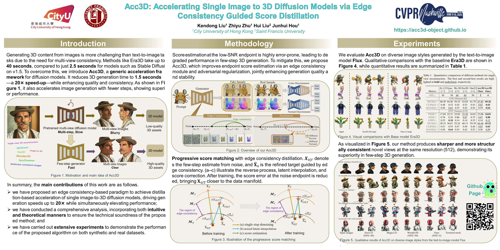

<br />
<p align="center">
    <h1 align="center">
        <a href="#">Acc3D</a>: Accelerating Single Image to 3D Diffusion Models via Edge Consistency Guided Score Distillation
    </h1>

  <p align="center">
  CVPR 2025
    <br />
    <strong>Kendong Liu</strong>
    ·
    <a href="https://scholar.google.com/citations?user=d1L0KkoAAAAJ&hl=en"><strong>Zhiyu Zhu*</strong></a>
    ·
    <strong>Hui Liu</strong>
    ·
    <a href="https://sites.google.com/site/junhuihoushomepage/"><strong>Junhui Hou</strong></a>
    ·
  </p>

  <p align="center">
    <a href='http://arxiv.org/abs/2503.15975'></a>
    <a href='https://acc3d-object.github.io/' style='padding-left: 0.5rem;'>
      </a>
  </p>

</p>
<br />

This repository contains the pytorch implementation for the paper [Acc3D: Accelerating Single Image to 3D Diffusion Models via Edge Consistency Guided Score Distillation](https://acc3d-object.github.io/), CVPR 2025. 



## News
- [2025-10-11] All training and test assets have been released.
- [2025-02-27] Our paper has been accpetd by CVPR 2025!

## Setup

### Cloning the Repository

Use the following command to clone:

```shell
git clone https://github.com/Kenkenzaii/Acc3D.git
```

### Python Environment

To prepare the Python environment needed to run Acc3D, execute the following commands:

```shell
conda env create -f environment.yaml
```

## Usage

### Training

```bash
1. Download the training dataset from this [Google Drive link](https://drive.google.com/drive/folders/1A_o1RqEBTO5XZEac93Xh26SG4vRztOtG?usp=sharing). And unzip the ``rendering_dataset.zip`` in ``training_data`` folder.
2. Download the base models from this [Google Drive link](https://drive.google.com/drive/folders/1lZyil8NnTlM2gguWBJiTjzaSpSQm4MgX?usp=sharing)
3. Before you can monitor the training process, make sure to log in to wandb with ``wandb login``.
4. Run bash train.sh

```

### Test

```bash
Run bash test.sh
```

## Acknowledgement

Thanks for the following wonderful works: [Diffusers](https://huggingface.co/docs/diffusers/index), [Era3D](https://github.com/pengHTYX/Era3D), [Wonder3D.](https://github.com/xxlong0/Wonder3D)

## Citation

```
@inproceedings{liu2025acc3d,
  title={Acc3D: Accelerating Single Image to 3D Diffusion Models via Edge Consistency Guided Score Distillation},
  author={Liu, Kendong and Zhu, Zhiyu and Liu, Hui and Hou, Junhui},
  booktitle={Proceedings of the Computer Vision and Pattern Recognition Conference},
  pages={18031--18040},
  year={2025}
}
```

